# 🚀 PWCode

## 📝 Introduction

PWCode is an online code learning and development platform, focusing on HTML, CSS, and JavaScript. This platform provides an intuitive coding environment along with features for programming education and classroom management.

[PWCode Platform](https://pwcode.vercel.app/)

## 🖼️ Interface Demo

Here are some screenshots demonstrating the PWCode interface:

### Homepage and Code Editor
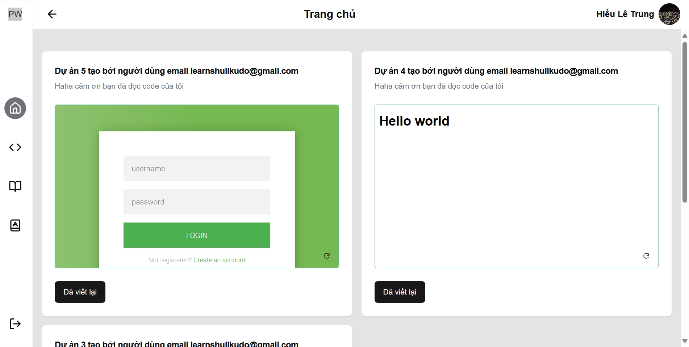
*PWCode homepage with featured projects and navigation*

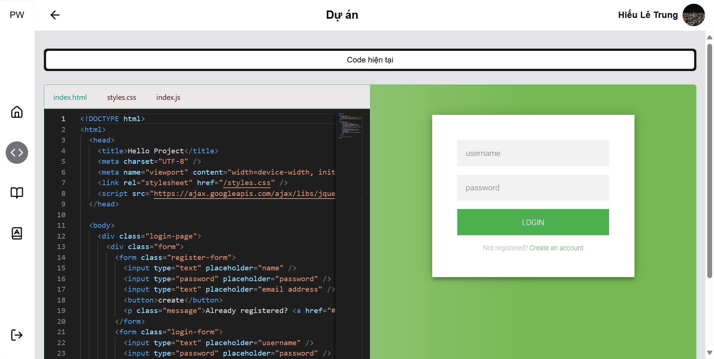
*Interactive code editor with live preview*

### Classroom Management
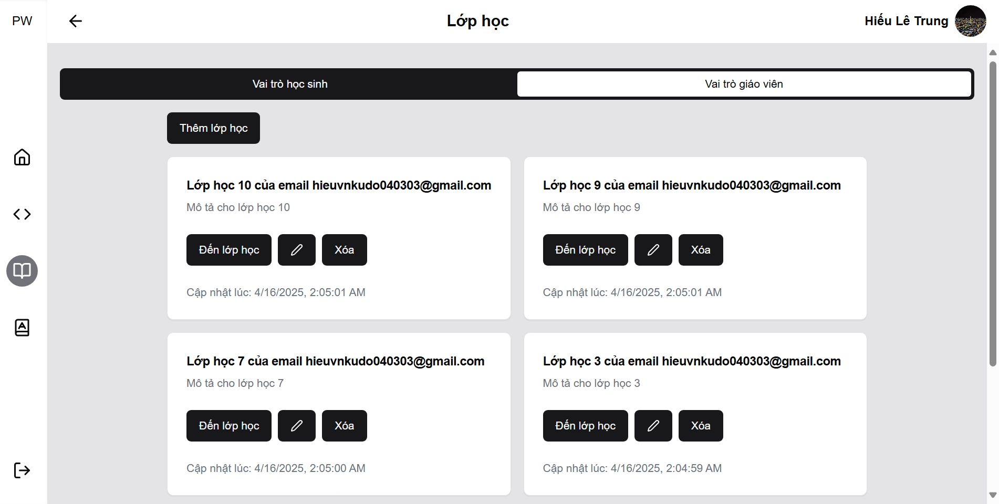
*Managing classes as a teacher*

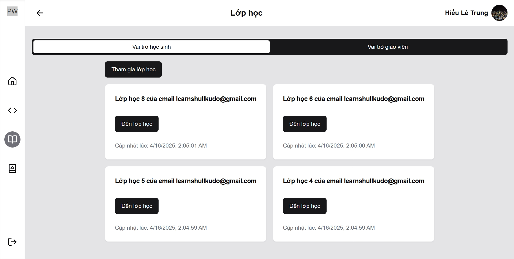
*Viewing classes as a student*

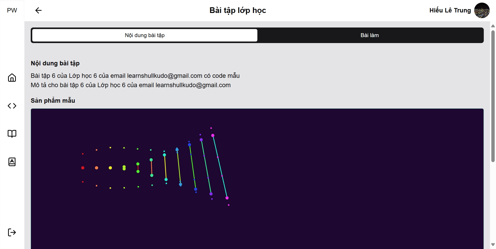
*Viewing assignments in a class*

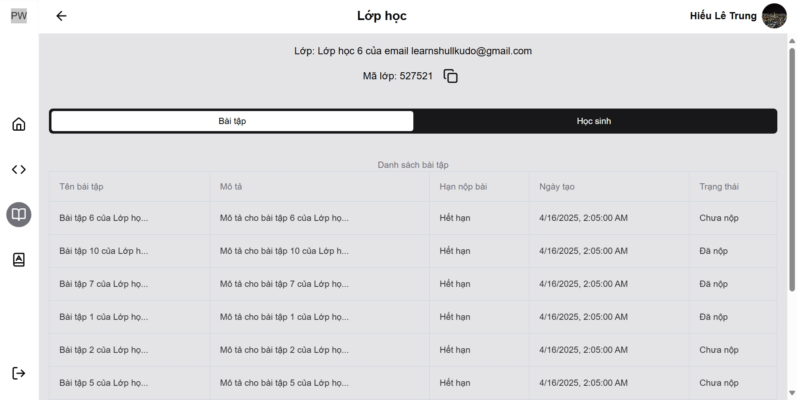
*Student's view of a class they've joined*

### Assignments and Submissions
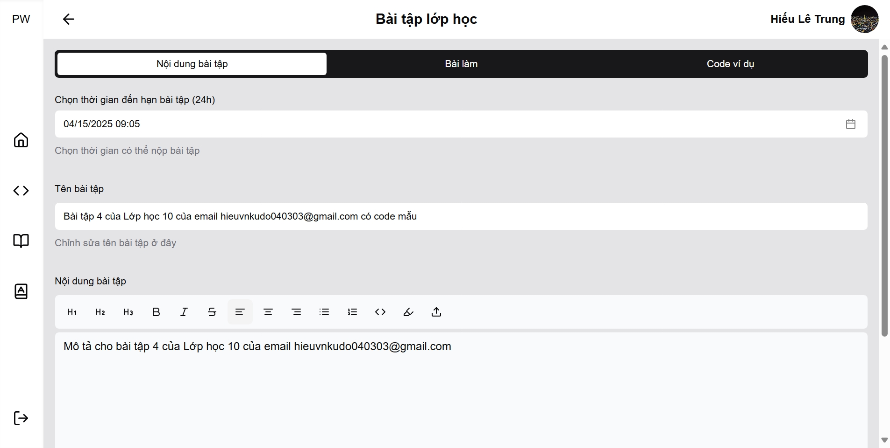
*Teacher editing an assignment*

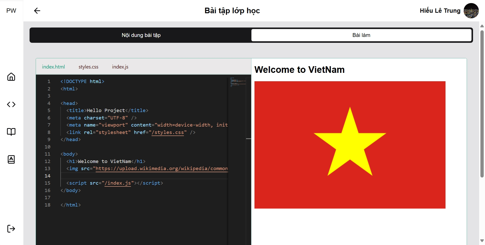
*Student working on an assignment*

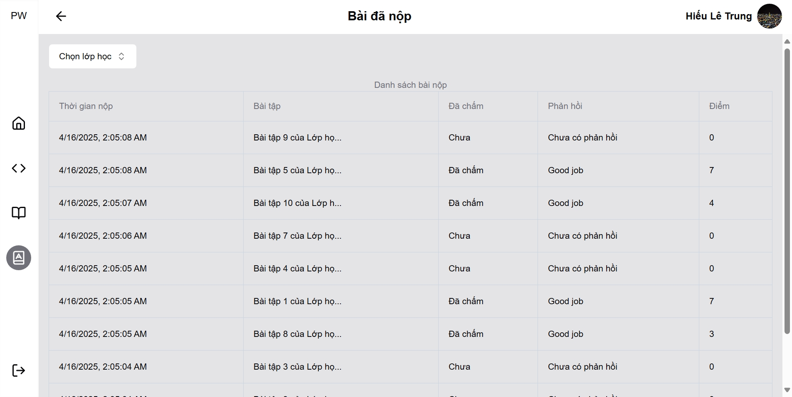
*Managing submitted code*

### AI Features
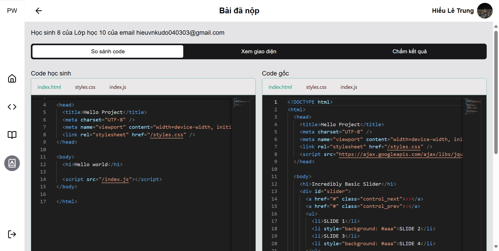
*Teacher reviewing student's code*

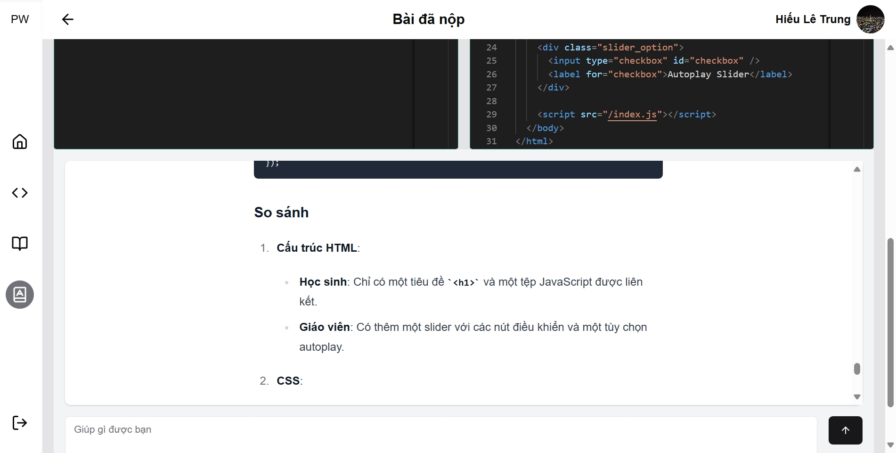
*Using GenAI to compare code*

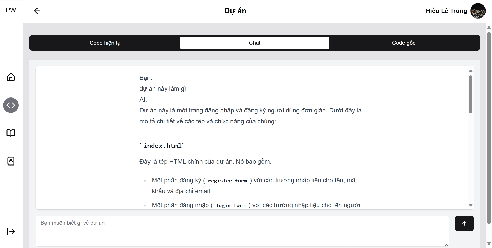
*Using GenAI to chat about code*

## ✨ Features

### 💻 Development Environment
- 🖥️ Edit and run HTML, CSS, JavaScript code directly in the browser
- 👁️ View code results instantly with preview mode
- 💾 Save and manage code projects

### 🌐 Social and Community Features
- 🔄 Share source code with other users
- 🔍 Explore other users' projects to learn

### 🏫 Classroom Management
- 📚 Create and manage classes
- 📝 Assign coding tasks to students, allowing them to work in the development environment
- ✅ Review and grade assignments

### 🤖 AI Technology
- 🧠 Support for code evaluation and comparison
- 🔰 Understand existing code with Gen AI

## 🛠️ Technologies Used

- **Frontend**: <span style="color: #61DAFB">Next.js</span>, <span style="color: #00D8FF">React 19</span>, <span style="color: #38B2AC">TailwindCSS</span>
- **Backend**: <span style="color: #000000">Next.js API Routes</span>
- **Database**: <span style="color: #336791">SQL</span> with <strong style="color: #FF4785">Drizzle ORM</strong>
- **Authentication**: <span style="color: #4285F4">NextAuth/Auth.js</span> with Google Auth
- **Code Editing**: <span style="color: #1976D2">Monaco Editor</span>, <span style="color: #F9A825">Sandpack</span>
- **Rich Text**: <span style="color: #5E35B1">TipTap Editor</span>
- **AI Integration**: <span style="color: #7F39FB">Mistral AI</span> with <strong>Vercel AI SDK</strong>

## 📂 Project Structure

```
📁 app/                       # Next.js App Router
   ├── 📄 layout.tsx          # Main page layout
   ├── 📄 page.tsx            # Home page
   ├── 📁 (f)/                # Main feature pages
   │   ├── 📁 assign/         # Assignment management
   │   ├── 📁 classes/        # Class management
   │   ├── 📁 projects/       # Project management
   │   └── 📁 submit/         # Submit assignments
   └── 📁 api/                # API Routes
       ├── 📁 auth/           # Authentication APIs
       ├── 📁 chat/           # Chat APIs
       ├── 📁 completion/     # Code completion APIs
       ├── 📁 guide/          # Guide APIs
       └── 📁 review/         # Code review APIs

📁 components/                # React Components
   ├── 📁 ai/                 # AI-related components
   ├── 📁 assign/             # Assignment management components
   ├── 📁 classes/            # Class management components
   ├── 📁 custom/             # Custom components
   ├── 📁 excel/              # Excel data export components
   ├── 📁 monaco/             # Monaco Editor
   ├── 📁 project/            # Project management components
   ├── 📁 sandpack/           # Code environment components
   ├── 📁 shared/             # Shared components
   ├── 📁 student/            # Student management components
   ├── 📁 submit/             # Submission components
   ├── 📁 tiptap/             # Rich text editor
   └── 📁 ui/                 # Basic UI components

📁 constants/                 # Constants and sample data
   ├── 📄 example-code.ts     # Sample source code
   ├── 📄 navigation.ts       # Navigation configuration
   ├── 📄 sandpack.ts         # Sandpack configuration
   └── 📁 example/            # Other examples

📁 context/                   # React Context Providers
   ├── 📄 path-context.tsx    # Path management
   └── 📄 tab-context.tsx     # Tab management

📁 db/                        # Database
   ├── 📄 drizzle.ts          # Drizzle ORM configuration
   ├── 📄 schema.ts           # Database schema
   ├── 📄 seed.ts             # Sample data generation script
   └── 📁 data/               # Static data

📁 hooks/                     # Custom React Hooks
   ├── 📄 use-mobile.ts       # Mobile device detection hook
   └── 📄 use-toast.ts        # Notification display hook

📁 lib/                       # Utility library
   ├── 📄 types.ts            # Type definitions
   ├── 📄 utils.ts            # Utility functions
   ├── 📁 action/             # Server Actions
   ├── 📁 ai/                 # AI integration
   ├── 📁 prompts/            # Prompt templates
   └── 📁 schemas/            # Validation schemas
```

The project structure is organized according to modern Next.js project model, with clear separation between UI (components) and logic (lib), ensuring modularity and maintainability. The project uses Next.js App Router and organizes features into separate modules.

## 🔄 System Integration Diagram

### Connection Description

- **Database (Neon.tech)**:
  - Stores user data, projects, classes, and assignments
  - Connects through Drizzle ORM to manage and query data
  - Supports source code storage and edit history

- **Mistral AI**:
  - Provides AI services for code analysis and evaluation
  - Supports code comparison between versions
  - Creates intelligent chatbots to explain source code

- **Google Auth**:
  - Authenticates users through OAuth 2.0
  - Manages login sessions and access permissions
  - Secures user information

## 🏗️ Building the Runtime Environment

To run the project, rename the `.env.example` file to `.env.local`.

### 🔑 Provide Necessary API Keys

- `AUTH_SECRET`: 🔐 Security key for authentication
- `MISTRAL_API_KEY`: 🧠 Mistral AI API key
- `AUTH_GOOGLE_ID` & `AUTH_GOOGLE_SECRET`: 🔑 Google authentication information
- `DATABASE_URL`: 🗄️ Database connection URL

### 📋 Installation Steps

1. 📥 Install required libraries
```bash
pnpm install
```

2. 🗄️ Create database
```bash
pnpm run push
```

3. 🚀 Run the project
```bash
pnpm run dev
```

4. 🧩 (Optional) Generate sample data
```bash
pnpm run seed
```

## 👥 Contribution

We always welcome contributions from the community. Please create issues or pull requests to contribute to the project.

## 📄 License

[MIT](LICENSE)